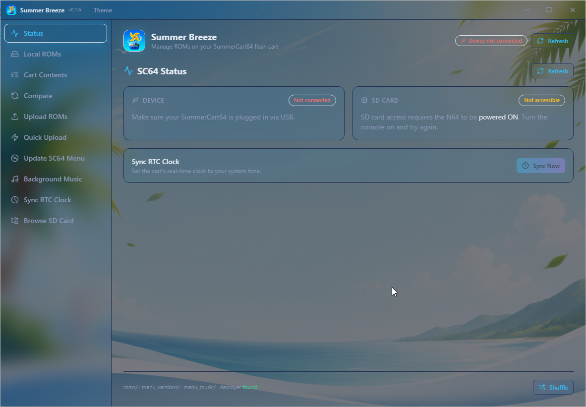

# Summer Breeze GUI

[](https://github.com/exusxt/Summer-Breeze-GUI/actions/workflows/ci.yml)
[](https://opensource.org/licenses/MIT)
[](https://github.com/exusxt/Summer-Breeze-GUI/releases)
[](https://exusxt.github.io/Summer-Breeze-GUI/)
[](https://github.com/exusxt/Summer-Breeze-GUI/wiki)

A cross-platform desktop GUI for managing ROMs on your SummerCart64 flash cart,
built on Electron with the Summer Breeze Python CLI doing the actual cart work
through a bridge process.



## Features

- **Thirteen built-in screens**: Status, Local ROMs, Cart Contents, Compare,
  Upload, Deploy to Cart, Quick Upload, Save Manager, SC64 Menu update,
  Background Music, RTC Clock sync, an SD card browser and a Console
- **Deploy to Cart**: flash any local ROM straight into the cart, optionally
  carrying a save file and save-type override; with "Back up first" enabled the
  cart's current save is dumped to disk before flashing so the previous game's
  progress is never lost (the backup is restorable from the Save Manager)
- **Save Manager**: back up the cart's save (EEPROM / SRAM / FlashRAM) to disk
  with per-game history, copy backups to the SD card's `/saves` save-filer
  folder or pull them back, and restore any backup by deploying it with a ROM
- **Add & verify ROMs**: the Local ROMs screen imports `.z64`, `.n64` or `.v64`
  files from a file picker, validates each one against its N64 header (magic
  word, byte order, title, game code and region), rejects files that are not
  N64 ROMs and skips duplicates by game identity — with the title, game code,
  byte order and region shown on every entry
- **SC64 menu downloads**: the Update SC64 Menu screen fetches the latest
  `sc64menu.n64` straight from GitHub — either the official N64FlashcartMenu
  release or TheLeggett's custom build (which adds background-music support) —
  validates it and drops it into the app's menu_versions folder, ready for the
  existing backup-and-upload flow
- **Cart info panel**: the Status screen shows the full `sc64deployer info`
  dump — firmware, RTC, save type, CIC seed, TV type, ROM configuration, 64DD
  state and SD card status
- **Console**: a live, persisted log of the bridge's sc64deployer output with
  copy/export, so "why did that deploy fail" is always answerable
- **Themes**: 14 themes including the Gallery Glass family with 9 photo
  backgrounds
- **Easy setup**: detects a Python 3.10+ interpreter (one-click install when
  missing) and downloads the official `sc64deployer` for you if it is missing
- **Auto-update**: checks for new versions on launch and via a title-bar button,
  downloads updates in the background and lets you install when ready

## Platforms & Downloads

Get the latest build from the [Releases page](https://github.com/exusxt/Summer-Breeze-GUI/releases).

| Platform | Artifacts |
| --- | --- |
| Windows | `Summer-Breeze-GUI-Setup-0.5.3.exe` (NSIS installer, universal x64 + arm64), `Summer-Breeze-GUI-0.5.3-x64.exe` (portable) and `Summer-Breeze-GUI-0.5.3-arm64.exe` (portable) |
| macOS | `Summer-Breeze-GUI-0.5.1.dmg` / `.zip` (Intel + Apple Silicon) |
| Linux | `.AppImage`, `.deb`, `.rpm` and `.pacman` (x64 + arm64) |

Auto-update behavior:

- **Installed builds** (Windows NSIS, macOS, Linux packages) update through
  `electron-updater` against the same GitHub release.
- **Windows portable** builds self-update by downloading the newer portable exe
  for their architecture and swapping it in on restart.

The builds are unsigned: Windows shows a SmartScreen warning and macOS requires
right-click → Open the first time.

## Requirements

- Python 3.10+ (the GUI runs the Python bridge; the CLI needs it directly) — if
  it is missing or too old, the app offers a one-click install on first launch
- SummerCart64 connected via USB
- `sc64deployer` binary (the GUI offers to download it; see setup below)
- The SC64's SD card is only reachable while your **N64 is powered ON**

## Setup

Install the app from the [Releases page](https://github.com/exusxt/Summer-Breeze-GUI/releases)
for your platform and start it. On first launch the app walks you through its
two runtime dependencies, each with a one-click option:

- **Python 3.10+** — the GUI drives the official Summer Breeze CLI through a
  Python bridge, so a compatible interpreter is required. If Python is missing
  or too old, a prompt offers to install it for you (silent winget/installer on
  Windows, the python.org wizard on macOS, package-manager guidance on Linux).
- **sc64deployer** — the official tool from the SummerCart64 project that talks
  to the cart. If it is not found, a prompt offers to download it automatically
  (stored persistently under `%APPDATA%\Summer Breeze\deployer`). Alternatively
  download it manually from the
  [SummerCart64 releases](https://github.com/Polprzewodnikowy/SummerCart64/releases)
  and place `sc64deployer.exe` (Windows) or `sc64deployer` (macOS/Linux — make
  it executable) next to `summerbreeze.py`.

Then connect your SummerCart64 over USB. The SD card is only reachable while
your **N64 is powered ON**.

## Directory Structure

```
Summer-Breeze-GUI/
├── gui/                  # Electron GUI source (bridge.py, src/, package.json)
├── summerbreeze.py       # Summer Breeze CLI (used as the GUI's backend)
├── sc64deployer          # Official SC64 deployer (macOS/Linux)
├── sc64deployer.exe      # Official SC64 deployer (Windows)
├── roms/                 # Put your ROM files here
│   ├── Game1.z64
│   └── ...
├── menu_versions/        # SC64 menu files for updates
├── menu_music/           # MP3 files for menu background music
└── README.md
```

## Usage

Start the GUI from your launcher, or run the CLI directly:

```bash
python summerbreeze.py
```

The interactive CLI provides the same operations as the GUI:

1. **Show Status** - Check device connection and SD card status
2. **List Local ROMs** - Show all ROMs in your local `roms/` folder
3. **List Cart Contents** - Show all ROMs on the SD card
4. **Compare** - Show which local ROMs are missing from the cart
5. **Upload ROMs to Cart** - Select ROMs and destination folder to upload
6. **Quick Upload** - Upload ROMs directly to SD card root
7. **Update SC64 Menu** - Update the menu firmware on your cart
8. **Set Menu Background Music** - Set custom menu music (requires a
   [custom menu](https://github.com/TheLeggett/N64FlashcartMenu))
9. **Sync RTC Clock** - Synchronize the cart's clock with your system time
10. **Browse SD Card** - Interactive browser for SD card contents

## Important: SD Card Access

The SC64's SD card is only accessible when your **N64 is powered ON**.

If you see "SD card: Not initialized", turn on your N64 and try again.

## Supported ROM Formats

- `.z64` - Big-endian (native N64 format)
- `.n64` - Little-endian
- `.v64` - Byte-swapped

## Troubleshooting

### "Device: NOT CONNECTED"
- Check USB cable connection
- Try a different USB port
- Ensure SC64 is properly seated in the N64 cartridge slot

### "SD card: Not initialized"
- Power ON your N64 console
- Wait a few seconds for the menu to boot
- Try again

### "sc64deployer not found"
- Use the in-app **Download sc64deployer** button, or
- Download the appropriate binary from the
  [SummerCart64 releases](https://github.com/Polprzewodnikowy/SummerCart64/releases)
  and place it next to `summerbreeze.py`
- On macOS/Linux, make sure it is executable: `chmod +x sc64deployer`

### macOS "cannot be opened" warning
- Right-click the app and choose **Open** the first time (the builds are unsigned)

## Development

### Python (CLI + bridge)

```bash
python3 -m venv .venv
source .venv/bin/activate        # Windows: .venv\Scripts\activate
pip install ruff pytest
```

```bash
ruff check .                     # Check for issues
ruff check --fix .               # Auto-fix issues
ruff format .                    # Format code
pytest -v                        # Run tests
```

### GUI (Electron)

```bash
cd gui
npm install
npm run dev                      # Electron with hot reload
npm run typecheck                # tsc for main + renderer
npm run dist:win                 # or dist:mac / dist:linux
npm run release                  # bump, CHANGELOG, tag, push (needs GH_TOKEN)
```

### CI

GitHub Actions runs ruff linting/formatting, Python tests (3.10–3.12) and the
GUI typecheck on every push. Pushing a `v*` tag runs the release workflow, which
builds and publishes Windows, macOS and Linux artifacts to a GitHub release.

## Credits

- [Summer Breeze](https://github.com/TheLeggett/Summer-Breeze) by TheLeggett — the original CLI this GUI builds on
- [SummerCart64](https://github.com/Polprzewodnikowy/SummerCart64) by Polprzewodnikowy
- [N64FlashcartMenu](https://github.com/Polprzewodnikowy/N64FlashcartMenu) (sc64menu.n64)
